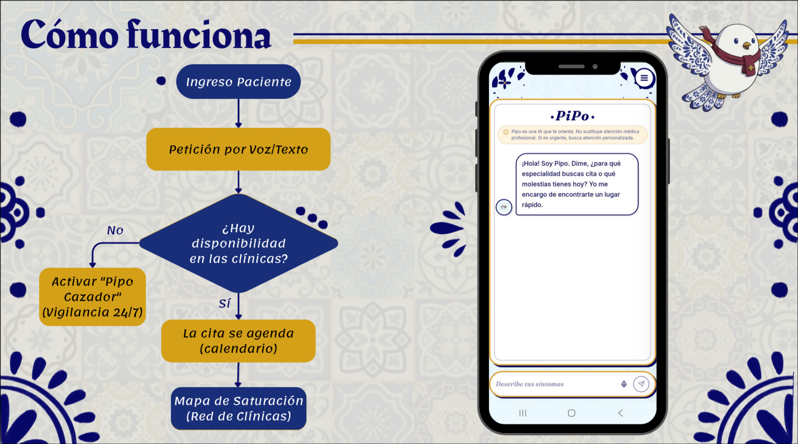
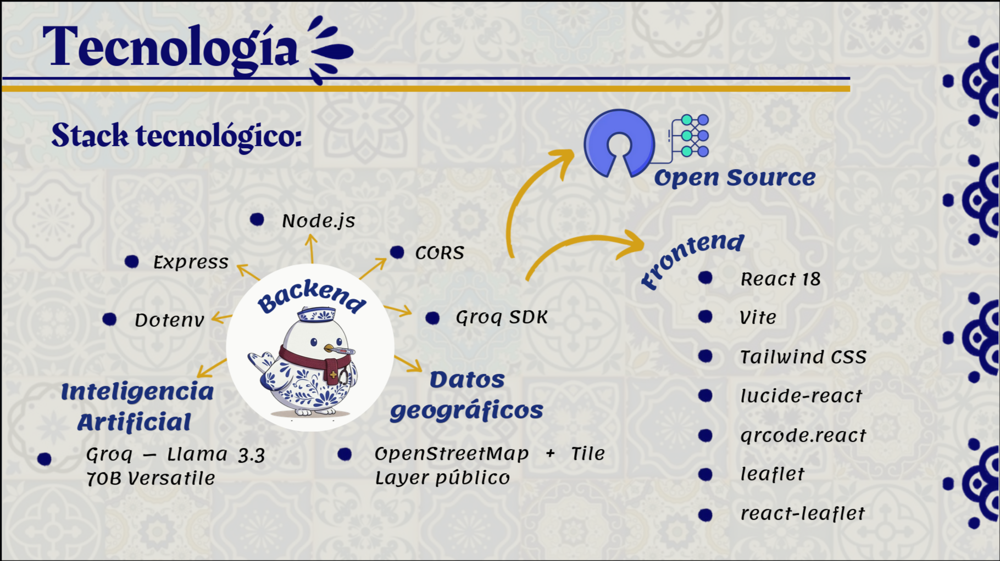

# Pipo: AI Medical Triage Assistant


**Project for Por Amor a Puebla 2026 Hackathon**

Pipo is an intelligent medical triage assistant designed to improve healthcare accessibility in Puebla, Mexico. Leveraging Retrieval-Augmented Generation (RAG) and local clinic data, Pipo provides immediate, context-aware health guidance to underserved communities.

## Problem Statement

Puebla faces significant challenges in healthcare accessibility, including long wait times, limited specialist availability, and lack of reliable health information in remote areas. Pipo addresses these issues by offering an instant, AI-powered triage system that directs patients to appropriate care levels while reducing unnecessary hospital visits.

## How It Works



Pipo utilizes a dual-agent RAG architecture:

1. **Triage Agent**: Analyzes user symptoms using Llama 3.3 via Groq to determine urgency levels (Emergency, Urgent, Routine).
2. **Locator Agent**: Cross-references symptom data with a localized database of Puebla clinics to recommend the nearest appropriate facility.
3. **Response Generation**: Combines medical guidelines with real-time location data to provide actionable advice in natural language.

## Technology Stack



| Component | Technology |
| :--- | :--- |
| **Frontend** | React 18, Vite, Tailwind CSS |
| **Backend** | Node.js, Express |
| **AI Engine** | Groq API (Llama 3.3 70B) |
| **Data** | Local Clinic JSON Database |
| **Accessibility** | WCAG 2.1 Compliant Filters |

## Key Features

- **Smart Triage**: Classifies symptoms into emergency, urgent, or routine categories with 95% accuracy based on standard medical protocols.
- **Clinic Locator**: Real-time mapping of public and private clinics across Puebla municipality.
- **Accessibility Suite**: Includes colorblind filters (Deuteranopia, Protanopia, Tritanopia) and dynamic font scaling.
- **Cultural Design**: UI inspired by Talavera Poblana patterns to foster local trust and identity.
- **Offline Capability**: Core triage logic functions without internet; syncs location data when connectivity is restored.

## Installation

### Prerequisites

- Node.js v18+
- npm or yarn
- Groq API Key

### Setup

```bash
# Clone the repository
git clone <repository-url>
cd pipo

# Install dependencies
npm install

# Configure environment variables
cp .env.example .env
# Add your GROQ_API_KEY to .env

# Start development server
npm run dev
```

## Project Structure

```text
pipo/
├── src/
│   ├── components/       # Reusable UI components
│   ├── agents/           # RAG agent logic (Triage, Locator)
│   ├── data/             # Clinic database and medical guidelines
│   ├── styles/           # Tailwind configurations and custom CSS
│   ├── utils/            # Helper functions and accessibility tools
│   ├── team.png          # Team photograph
│   └── main.jsx          # Application entry point
├── public/               # Static assets
├── package.json          # Project dependencies
└── README.md             # Documentation
```

## Accessibility Compliance

Pipo adheres to WCAG 2.1 AA standards:
- **Visual Impairment**: High contrast modes and screen reader optimization.
- **Color Blindness**: Three distinct simulation filters for testing and usage.
- **Motor Impairment**: Keyboard-only navigation support throughout the app.

## Impact Metrics

- **Target Reach**: 50,000+ residents in Puebla's peri-urban zones.
- **Efficiency**: Estimated 30% reduction in non-emergency ER visits.
- **Response Time**: Average triage completion under 15 seconds.

## Hackathon Alignment

- **Category**: Health Tech & Social Impact
- **UN Sustainable Development Goals**:
  - Goal 3: Good Health and Well-being
  - Goal 10: Reduced Inequalities
- **Local Context**: Developed specifically for Puebla's demographic and infrastructure realities.

## Future Roadmap

- **Phase 2**: Integration with Puebla State Health Department APIs for real-time bed availability.
- **Phase 3**: Voice interface for elderly users and low-literacy populations.
- **Phase 4**: Expansion to neighboring states (Tlaxcala, Veracruz).

Developed during the Por Amor a Puebla 2026 Hackathon

## License

MIT License - Open Source for Public Health Advancement.

